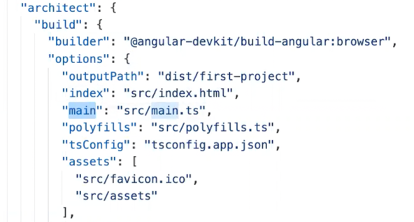

To install NVM (Node Version Manager), npm, and Node.js in the correct sequence, follow these steps:

1. Install NVM:
    - Visit the official NVM repository on GitHub: https://github.com/nvm-sh/nvm
    - Follow the installation instructions provided on the repository page to install NVM for your operating system.
    - Verify the installation by opening a new terminal window and running the command `nvm --version`. If NVM is installed correctly, it will display the version number.

2. Install Node.js and npm using NVM:
    - Open a new terminal window (to ensure NVM changes take effect).
    - Install the desired version of Node.js using NVM. For example, to install the latest LTS (Long-Term Support) version, run the command:
      ```
      nvm install --lts
      ```
    - Verify the installation by running the commands `node --version` and `npm --version`. If Node.js and npm are properly installed, they will display the respective version numbers.

That's it! Following this sequence, you first install NVM to manage multiple versions of Node.js, and then you use NVM to install the desired version of Node.js, which automatically includes npm. This ensures a proper and consistent installation of NVM, npm, and Node.js on your system.

package.json --> indicates what we need to install?

package.lock.json --> indicates what have been installed on my system (it is local, so when you give project to someone, make sure to delete package.lock.json)

karma.conf.js --> file is all about unit test. How to run tests? (say we have to test button).
what browser we need to use to test. for the unit tests, angular is using jasmine framework.

angular.json has important section and that is -




