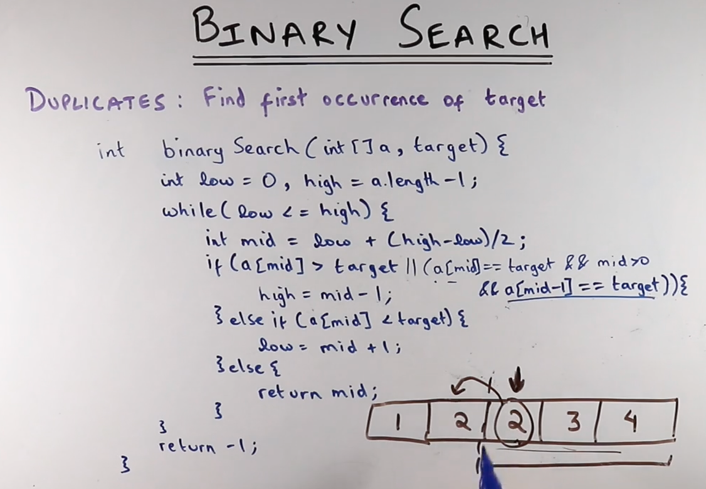
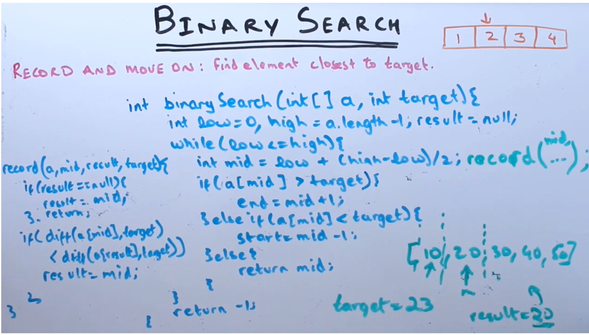

****
we are finding the 1st occurrence, meaning 
if we get the target then we have to check index of target minus 1 is also
same as target, here we simply keep the algorithm same
and make high = mid - 1, this way we use existing logic
to continue the calculation.

---------------------------------------------------

[ Next problem ]

Actually in bonary search we are already moving to the target meaning, every attempt we find the 
closest number, in this kind of problem, we simply has to
record the difference between the target and arr[mid]
and return the smallest.

in the image, we have record method for recording the smallest difference.
and record method has input array, mid, result(here we record the smallest diff), target.

