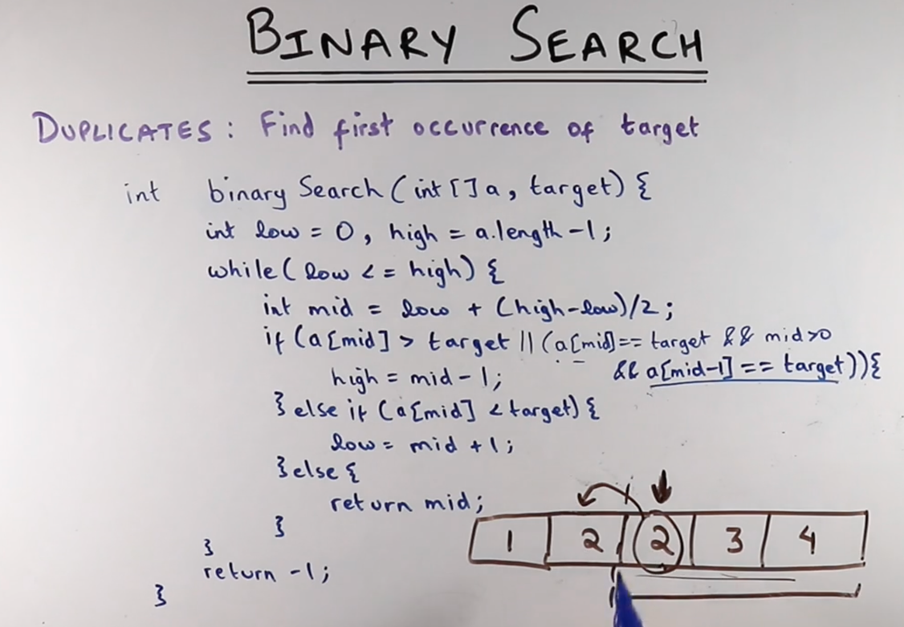

****
we are finding the 1st occurrence, meaning 
if we get the target then we have to check index of target minus 1 is also
same as target, here we simply keep the algorithm same
and make high = mid - 1, this way we use existing logic
to continue the calculation.

