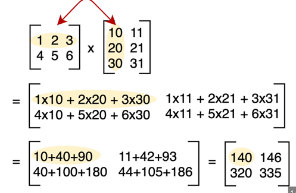

Matrix multiplication

operations are as below.

| (a)row  | (a)col  | (b)row   | (b)col  |
| :------------ |:---------------:| -----:| -----:|
| 0     |  (0, 1, 2) |  (0, 1, 2) |  0 | 
| 0    |  (0, 1, 2)        |  (0, 1, 2) | 1 | 

| (a)row  | (a)col  | (b)row   | (b)col  |
| :------------ |:---------------:| -----:| -----:|
| 1     |  (0, 1, 2) |  (0, 1, 2) |  0 | 
| 1   |  (0, 1, 2)        |  (0, 1, 2) | 1 | 

we see a patterns -

pattern-1 : `(a)col` and `(b)row` are always same and iterating from 0 to n.

pattern-2 : `(a)row` repeating same as number of rows in a matrix or columns in b matrix.

pattern-3 : `b(col)` in repeating by increasing fromo to number of rows in a matrix.

