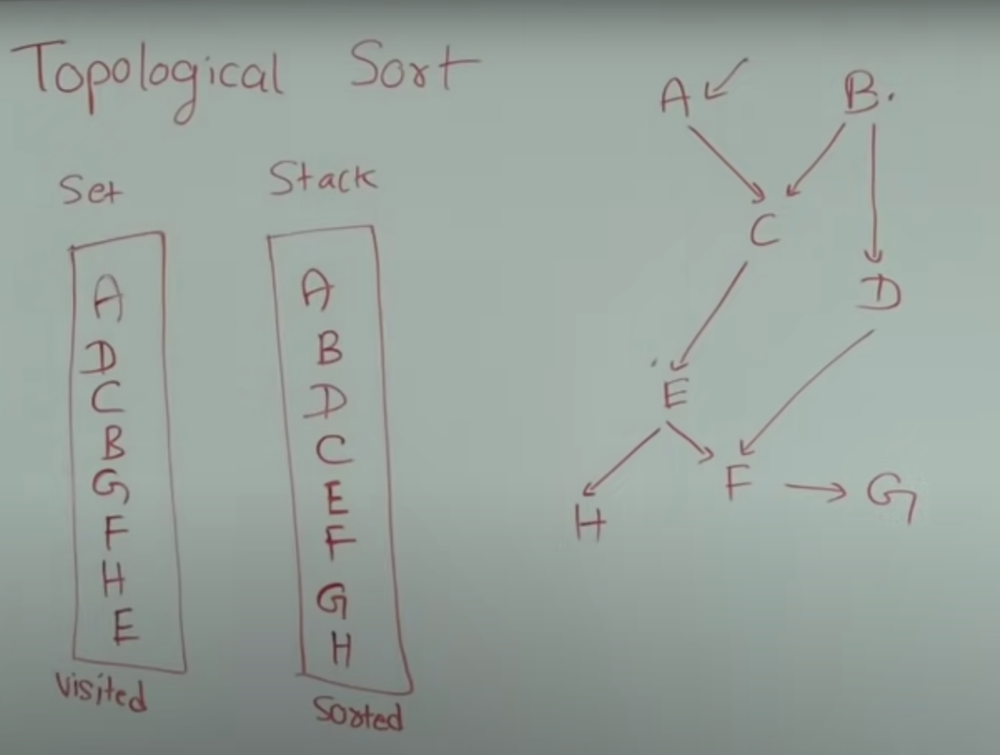

step 1 - select node (random) and keep inside the
visited SET. if we explore all it's children and no more
children to explore then keep inside stack.

steps 

Take (random)vertex E, keep in visited set
then E has H and F children and those are not visited.
Take H first and it is not visited so
keep them in visited stack and it has no more
children to keep inside stack. 