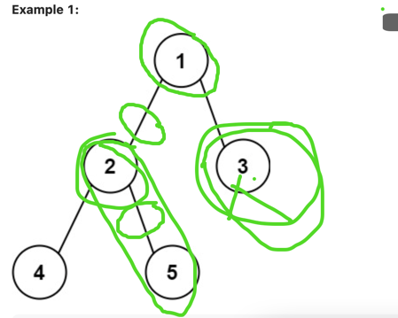

Diameter of tree

visualization -

implementation.

------------------------------------------------------------

New Example (DiameterOfBinaryTree)

we are considering edges not nodes so returning (diameter - 1),
please see the diagram.

